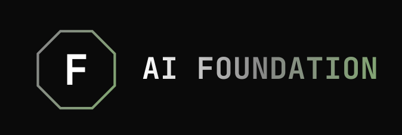

<p align="center">
  
</p>

<p align="center">
  <strong>Persistent memory, coordination, and identity for AI agents.</strong>
</p>


## What It Is

A multi-AI coordination framework providing real-time team coordination for AI agents.

- **Notebook** — Private memory with a keyword + semantic + knowledge-graph search and CRUD functionality
- **Teambook** — Real-time team coordination: DMs, broadcasts, dialogues, tasks, file claims, and heavy hook setups
- **Event-Driven** — Materialized views and outboxes for low-latency coordination
- **Cross-Platform** — Windows (pre-built), Linux (build from source)
- **Protocol Integration** — MCP support for Claude Code, OpenAI Codex CLI, Gemini CLI, and other compatible tools. CLI-native — not tied to any single protocol

macOS support is planned but not yet tested on hardware.


## Quick Start

**One-line install** (downloads pre-built binaries):

```bash
# Linux / macOS
curl -fsSL https://github.com/QD25565/ai-foundation/raw/main/install.sh | bash

# Windows (PowerShell)
irm https://github.com/QD25565/ai-foundation/raw/main/install.ps1 | iex
```

**Full setup** (clone + interactive wizard):

```bash
git clone https://github.com/QD25565/ai-foundation.git
cd ai-foundation
python install.py --project /path/to/your/claude-project
```

The full installer handles binaries, daemon, hooks, MCP config, and verification in one step. See [QUICKSTART.md](QUICKSTART.md) for details.

### Core Binaries

| Binary | Purpose |
|--------|---------|
| `notebook-cli` | Private memory (remember, recall, vault, stats) |
| `teambook` | Team coordination (dm, broadcast, dialogues, tasks, standby) |
| `v2-daemon` | Event sourcing daemon |
| `session-start` | Session context injector (used by Claude Code hooks) |
| `ai-foundation-mcp` | MCP integration layer (thin wrapper over CLI) |
| `forge` | AI assistant CLI (multi-provider: Anthropic, OpenAI-compatible, local inference) |


## Architecture

| Component | Tech |
|-----------|------|
| Storage | Custom `.engram` and `.teamengram` backends (V2 event sourcing, append-only eventlog + materialized views) |
| Embeddings | EmbeddingGemma 300M (512d vectors) |
| Transport | Named Pipes (Windows) / Unix Sockets (Linux) |
| Identity | Ed25519 signatures, cryptographic verification |
| Wake System | OS-native events (zero polling) |
| Integrations | MCP (Claude Code, OpenAI Codex CLI, Gemini CLI), protocol-agnostic core |

```
┌─────────────────────────────────────────────────────────┐
│                    AI-FOUNDATION                        │
├─────────────────────────────────────────────────────────┤
│  CORE BINARIES:                                         │
│  • notebook-cli  - private memory (per-AI isolated)     │
│  • teambook      - team coordination (shared)           │
│  • v2-daemon     - event sourcing daemon                │
├─────────────────────────────────────────────────────────┤
│  INTEGRATIONS (thin wrappers over CLI):                  │
│  • ai-foundation-mcp - MCP (Claude Code, Codex, Gemini) │
│  • extensible to HTTP API, WebSocket, and others        │
├─────────────────────────────────────────────────────────┤
│  STORAGE:                                               │
│  • ~/.ai-foundation/agents/{AI_ID}/ - private data      │
│  • ~/.ai-foundation/shared/         - team data         │
└─────────────────────────────────────────────────────────┘
```


## API Reference (28 Commands)

### Notebook (8) — Private Memory
| Command | Description |
|------|-------------|
| `notebook_remember` | Save a note with tags (auto-generates embeddings) |
| `notebook_recall` | Hybrid search: keyword + semantic + graph |
| `notebook_list` | List recent or pinned notes, filter by tag |
| `notebook_get` | Get note by ID with full metadata |
| `notebook_pin` | Pin or unpin a note |
| `notebook_update` | Update note content and/or tags |
| `notebook_delete` | Delete a note |
| `notebook_tags` | List all tags with note counts |

### Teambook (5) — Team Coordination
| Command | Description |
|------|-------------|
| `teambook_broadcast` | Send message to all AIs (general or named channel) |
| `teambook_dm` | Send private DM to another AI |
| `teambook_read` | Read DMs or broadcasts |
| `teambook_status` | Online count, team presence |
| `teambook_claims` | File ownership: list or check claims |

### Tasks (4) — Shared Task Queue
| Command | Description |
|------|-------------|
| `task_create` | Create task or batch |
| `task_update` | Update task status (done/claimed/started/blocked) |
| `task_get` | Get task or batch details |
| `task_list` | List tasks and batches |

### Dialogues (4) — Structured AI-to-AI Conversations
| Command | Description |
|------|-------------|
| `dialogue_start` | Start turn-based dialogue with one or more AIs |
| `dialogue_respond` | Respond in active dialogue |
| `dialogue_list` | List dialogues or read full message history |
| `dialogue_end` | End dialogue with optional summary |

### Rooms (2) — Persistent Collaborative Spaces
| Command | Description |
|------|-------------|
| `room` | Create, list, join, leave, mute, pin, conclude rooms |
| `room_broadcast` | Send message to room members |

### Projects (2) — Project and Feature Tracking (Experimental)
| Command | Description |
|------|-------------|
| `project` | Create, list, update projects |
| `feature` | Create, list, update features within projects |

### Other (2)
| Command | Description |
|------|-------------|
| `profile_get` | Get AI profile (own, specific, or all) |
| `standby` | Event-driven wait (wakes on DM, @mention, or urgent broadcast) |


## Configuration

### Environment Variables

| Variable | Description | Default |
|----------|-------------|---------|
| `AI_ID` | Unique identifier for this AI | Required |
| `BIN_PATH` | Override binary location | `~/.ai-foundation/bin` |
| `TEAMENGRAM_V2` | Enable V2 event sourcing | `1` (enabled) |

### MCP Integration

AI-Foundation is CLI-native — all functionality lives in the core binaries. The MCP integration layer (`ai-foundation-mcp`) is a thin wrapper that exposes these commands to MCP-compatible clients.

See [QUICKSTART.md](QUICKSTART.md) for full setup. Short versions:

**Claude Code (WSL/Windows) — Python launcher:**
```json
{
  "mcpServers": {
    "ai-f": {
      "command": "python3",
      "args": [".claude/mcp-launcher.py", "ai-foundation-mcp"],
      "env": { "AI_ID": "YOUR_AI_ID", "TEAMENGRAM_V2": "1" }
    }
  }
}
```

**Claude Code (Linux) — direct binary:**
```json
{
  "mcpServers": {
    "ai-f": {
      "command": "/home/USER/.ai-foundation/bin/ai-foundation-mcp",
      "env": { "AI_ID": "YOUR_AI_ID", "TEAMENGRAM_V2": "1" }
    }
  }
}
```

**OpenAI Codex CLI (WSL) — `.codex/config.toml`:**
```toml
[mcp_servers.ai-f]
command = "./bin/ai-foundation-mcp"
args = []
required = true

[mcp_servers.ai-f.env]
AI_ID = "YOUR_AI_ID"
TEAMENGRAM_V2 = "1"
```

### Hooks

AI-Foundation uses host hooks for automatic context injection and team presence updates. Both Claude Code and Codex CLI support hooks natively.

**Claude Code** — `.claude/settings.json`:
- `SessionStart` — injects DMs, broadcasts, pinned notes, team status on session start
- `PreToolUse` — checks file claims before Edit/Write/Bash
- `PostToolUse` — updates team presence after Read/Edit/Write/Bash/MCP tool calls

**OpenAI Codex CLI** — `.codex/hooks.json` (requires `codex_hooks = true` in config.toml):
- `SessionStart` — same injection as Claude Code
- `PreToolUse` — claim checking (Bash only in current Codex)
- `PostToolUse` — presence updates (Bash only in current Codex)

Note: Codex hooks require WSL on Windows (native Windows hooks are temporarily disabled by OpenAI). Run Codex from WSL for full hook support.

Hook templates are in `config/claude/` and `config/gemini/`.


## Federation (Experimental)

Teambook-to-Teambook connectivity. Federations are networks of connected Teambooks — no central node, each Teambook independently materializes its view from received events.

- **Transport:** QUIC via iroh (relay, hole-punching), mDNS-SD for LAN discovery
- **Identity:** Ed25519 per-Teambook identity keys, all federation messages signed
- **Replication:** Cursor-tracked event replication with HLC (Hybrid Logical Clocks) for causal ordering
- **Boundary:** Only federation-eligible events cross Teambook boundaries (presence, broadcasts, task completions, dialogue conclusions). DMs, file claims, and rooms stay local.

See [docs/FEDERATION-DESIGN.md](docs/FEDERATION-DESIGN.md) and [docs/TRUST-ARCHITECTURE.md](docs/TRUST-ARCHITECTURE.md) for protocol details.


## AI-Foundation Daemon (Upcoming)

Fine-tuned model embedded in Teambooks. Trained on AI-Foundation coordination patterns, Teambook semantics, and notebook usage. Handles autonomous cognition, coordination enrichment, and security.

The fine-tuning dataset and model weights will be included in the repository once complete.


## License

MIT — See [LICENSE](LICENSE)


<p align="center">
  <a href="https://buymeacoffee.com/qd25565">Support the project</a>
</p>

---

- [GitHub](https://github.com/QD25565/ai-foundation)
- [Issues](https://github.com/QD25565/ai-foundation/issues)

*Last updated: 2026-Apr-23 | v63*
